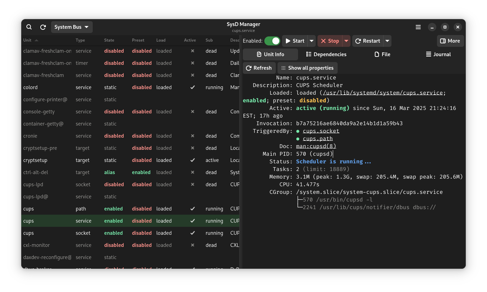
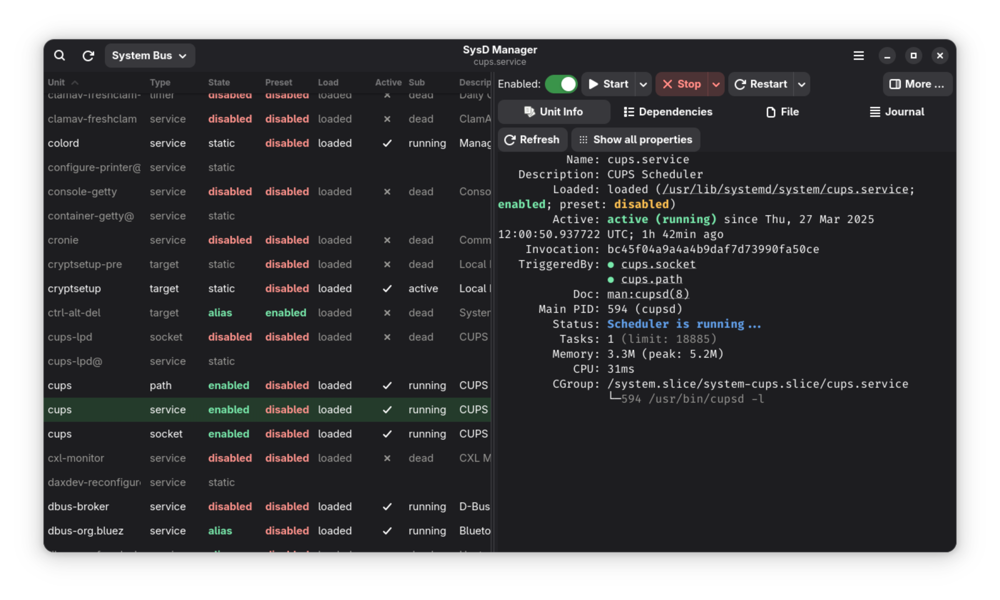

<div align="center">


# SysD Manager

[](https://raw.githubusercontent.com/plrigaux/sysd-manager/refs/heads/main/LICENSE)
[](https://github.com/sponsors/plrigaux)
[](https://flathub.org/apps/io.github.plrigaux.sysd-manager)

A user-friendly GUI to manage systemd units

</div>

## 📋 Description

- Change the enablement and running status of systemd units
- View and modify unit files with syntax highlighting
- Check journal logs with syntax highlighting
- Explore unit dependencies visually
- And much more!

> **Disclaimer:** This application is intended for users with less experience with systemd rather than professional system administrators. If you consider yourself an administrator, please refer to `systemctl` and `journalctl` documentation.

## ✨ Features

| Feature | Status |
|---------|--------|
| Unit file browser with search and filtering | ✅ |
| Enable or disable a unit | ✅ |
| Enable a unit in runtime | ✅ |
| Activate or deactivate a unit | ✅ |
| View and modify unit file | ✅ |
| View and navigate unit's dependencies | ✅ |
| Unit file syntax highlighting | ✅ |
| Journal file syntax highlighting | ✅ |
| List of all running units (systemd-analyze blame) | ✅ |
| Dark and Light style switching | ✅ |
| Select a unit at program opening via CLI | ✅ |
| Clean unit like `systemctl clean` | ✅ |
| Freeze & Thaw unit like `systemctl freeze` and `systemctl thaw`  | ✅ |
| Multi-language support | ✅ 🚧 |
| Real-time journal events update | ✅ |
| Retrieve list of boot IDs | ✅ |
| Ability to watch _systemd_ signals | ✅ |

*Need a feature? Contact the author or contribute to the project! If you're stuck, take a look at `systemctl`.*

## 📸 Screenshots

<div align="center">

### Unit Info (Dark)


### Unit Info (Light)


### Unit Dependencies


### Unit Files


### Unit Journal


</div>

## 🔧 Installation

### Flathub
<a href="https://flathub.org/apps/io.github.plrigaux.sysd-manager"></a>

### Arch Linux

<a href="https://aur.archlinux.org/packages/sysd-manager"></a>


```bash
yay -S sysd-manager
```

### Build from Source

1. Install prerequisites:
   - [Rust](https://www.rust-lang.org/tools/install)
   - GTK 4 and build essentials ([how-to](https://gtk-rs.org/gtk4-rs/stable/latest/book/installation_linux.html))
   - Libadwaita ([how-to](https://gtk-rs.org/gtk4-rs/stable/latest/book/libadwaita.html))
   - Systemd development library (`libsystemd-dev`)
   - GtkSourceView 5 development library

2. Clone and build:
```bash
git clone https://github.com/plrigaux/sysd-manager
cd sysd-manager
sh install.sh
```

3. Run:
```bash
sysd-manager
```

*For a clean removal, execute:* `sh uninstall.sh`

## 🧪 Testing

You can safely test SysD Manager using **tiny_daemon**, a simple web server service included with the project:

```bash
cd packaging
python install_tiny
```

## 🛣️ Roadmap

Planned features:
- Non-blocking calls (in progress)
- Always administrator mode
- Continuous UX improvements

## 📝 Changelog

All notable changes are documented in the [CHANGELOG](CHANGELOG.md).

## 🤝 Contributing

Interested in contributing? Contact the project maintainer on [GitHub](https://github.com/plrigaux/sysd-manager).

## 🌐 Internationalization

__SysD Manager__ interface can be displayed in different languages.

### Translators

I made some tools to help translation

### Generate POTFILES

To generate the POTFILES file that contains the list of input files to look for to exrtact translatable strings. 
```
cargo run -p transtools -- potfiles
```

_Normally a translator don't have to use this command_

## 💡 Credits

This project is inspired by the work of Guillaume Gomez: https://github.com/GuillaumeGomez/systemd-manager/
