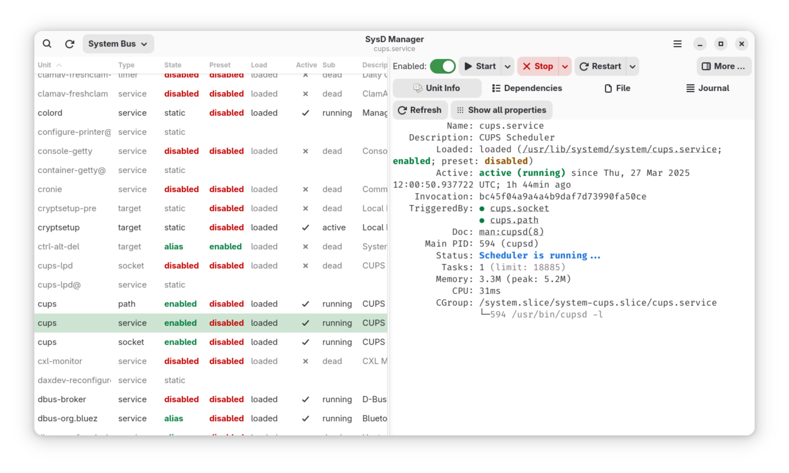
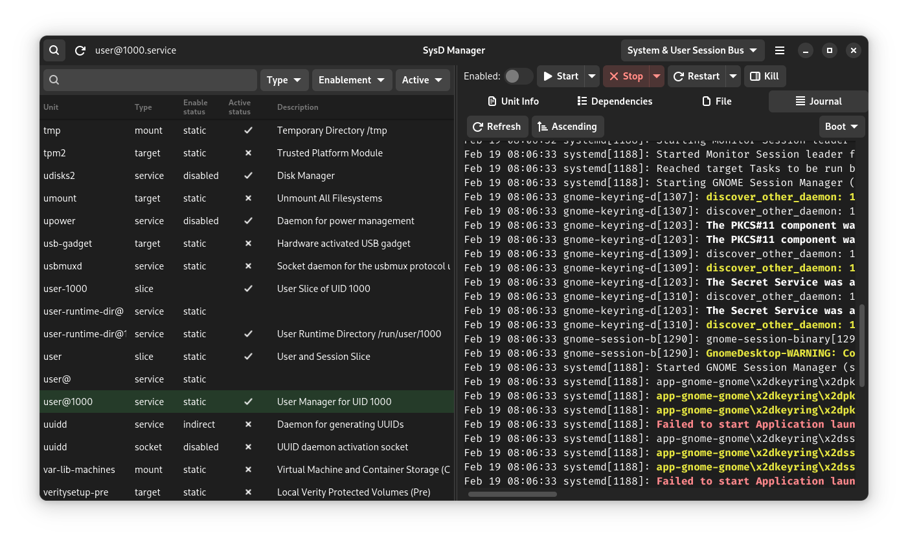

# SysD Manager

This application exists to easily allow user to manage their **systemd units** via a GUI. Not only are you able to make changes to the enablement and running status of each of the units, but you will also be able to view and modify their unit files and check the journal logs. 

## Disclaimer
This application is not intended to a profesional system administrator audience. 

If you consider yourself an administator, please refer to `systemctl` and `journalctl` documentation.

## Features

Here are __Sysd Manager__ main features :
* Unit file browser with serach and filtering
* Enable or disable a unit
* Activate or deactivate a unit
* View and modify unit file
* View and navigate unit's dependencies
* Unit file syntax highlighting 
* Journal file syntax highlighting 
* List of all running units, ordered by the time they took to initialize __systemd-analyze blame__
* Follow Dark and Light style switching
* Select a unit at program opening by passing a unit name as cli argument (see --help)


*__Note__ if you need a feature communicate with the author or contribute to the project. If you're stuck take a look at __systemctl__.*

## Changelogs

All notable changes to this project are documented in [CHANGELOG](CHANGELOG.md) .


## Requirement

Any Linux distribution that has adopted **systemd**.

## Screenshots








## Credit
This project is inspired by the work of Guillaume Gomez https://github.com/GuillaumeGomez/systemd-manager/

## Contributing
Contact me on my [GitHub](https://github.com/plrigaux/sysd-manager) if you want to contribute to this project.

## Project Roadmap
For now new features are planned to be added, such as:

* Non-blocking calls (in progress)
* Always administrator mode
* Improve UX (continuously)

## Installation Instructions

### From your computer

* Download and install rust https://www.rust-lang.org/tools/install
* Install the build essentials
  * Install GTK 4 and the build essentials. [how-to](https://gtk-rs.org/gtk4-rs/stable/latest/book/installation_linux.html)
  * Install libadwaita [how-to](https://gtk-rs.org/gtk4-rs/stable/latest/book/libadwaita.html)
  * Install systemd development library **libsystemd-dev**
* Compile and install  ```cargo install sysd-manager```
* Run ```sysd-manager```

### Arch

A Arch package has been made for __SysD Manager__. It can be found at  https://aur.archlinux.org/packages/sysd-manager

### Flathub

__SysD Manager__ has a Flathub version. Search it on Gnome software or drirectly at https://flathub.org/apps/io.github.plrigaux.sysd-manager


### APT
*Later waiting for a contributor or when I will reinstall e Debian like distro*


## Testing

If you want to test **Sysd Manager** without risking to shutdown important services, you can do it with **tiny_daemon**. **tiny_daemon** is a service provided with the project as a simple web server that you can safely play with.

To install **tiny_daemon**, in the project directory, just run this python script.


```
cd packaging
python install_tiny 
``` 

[](https://www.gnu.org/licenses/gpl-3.0)
