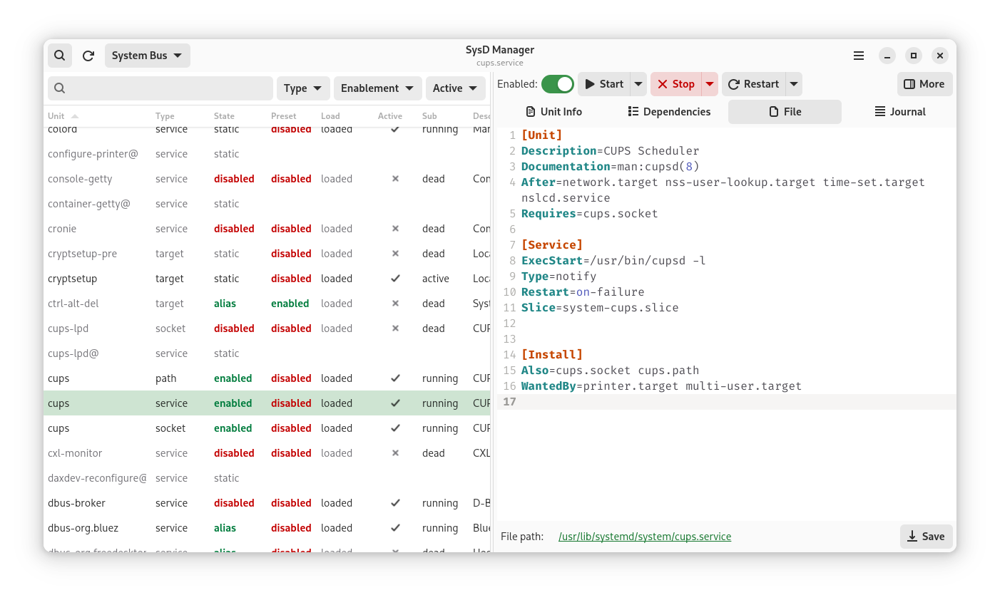
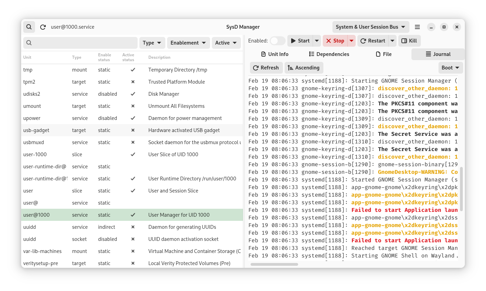

# SysD Manager

This application exists to easily allow user to manage their **systemd units** via a GUI. Not only are you able to make changes to the enablement and running status of each of the units, but you will also be able to view and modify their unit files and check the journal logs. 

## Features

Here are __Sysd Manager__ main features :
* Enable or disable a unit
* Activate or desactivate a unit
* View and modify unit file
* List of all running units, ordered by the time they took to initialize __systemd-analyze blame__


*__Note__ if you need a feature communicate with the author or contribute to the project. If you're stuck take a look at __systemctl__.*

## Requirement

Any Linux distribution that has adopted **systemd**.

## Screenshots






## Credit
This project is inspired by the work of Guillaume Gomez https://github.com/GuillaumeGomez/systemd-manager/

## Contributing
Contact me on my [GitHub](https://github.com/plrigaux/sysd-manager) if you want to contribute to this project.

## Project Roadmap
For now new features are planned to be added, such as:
* File list browser
* Non-blocking calls
* Syntax highlighting 
* Always administrator mode
* Svec the window state
* Improve UX
    * Better layout
    * Follow Dark and Light syte switch

## Installation Instructions


### From your computer

* Download and install rust https://www.rust-lang.org/tools/install
* Install the build essentials
  * Install GTK 4 and the build essentials. [how-to](https://gtk-rs.org/gtk4-rs/stable/latest/book/installation_linux.html)
  * Install libadwaita [how-to](https://gtk-rs.org/gtk4-rs/stable/latest/book/libadwaita.html)
* Compile and run  ```cargo run```

### Install on RHEL, Fedora, and CentOS based distributions
You can install the application from COPR

#### Add the repo
First, you need to have dnf-plugins-core installed
```
sudo dnf install dnf-plugins-core
```

Then you can enable the repo with the following command
```
sudo dnf copr enable plrigaux/sysd-manager
```
#### Install with dnf

Then you can simply install sysd-manager with the following command
```
sudo dnf install sysd-manager
```
### Generate RPM for copr

1 be in the mock group
Add your user name to the mock group
```
sudo usermod -a -G mock <my user name>
```

### Generate a RPM localy
You can generate youe rpm localy with the help of the crate `cargo-generate-rpm`.

#### Install
```
cargo install cargo-generate-rpm
```

#### Usage
```
cargo build --release
strip -s target/release/sysd-manager
cargo generate-rpm
```

#### Install with dnf

Then you can install sysd-manager with the following command 

*Don't forget to ajust the the rpm file path*
```
sudo dnf localinstall target/generate-rpm/sysd-manager[version-release-arch].rpm
```

#### Setup 
```bash
cargo install cargo-generate-rpm
```
#### Usage
Run the following script. 

```bash
sh ./create_rpm
```

It will create a rpm file in the target/generate-rpm subdirectory.

### Flatpak

#### Install the builder

```
flatpak install org.flatpak.Builder
```

#### Build the flatpak
```
./goflatub build
```

#### Run the flatpak

To run the compiled flatpak execute the following command
```
./goflatub run
```

To access all program's functionnalities, you need the to have program __flatpak-spawn__ install on your system.


#### Possible issue

No remote refs found for ‘flathub’


```
flatpak remote-add --user --if-not-exists flathub https://flathub.org/repo/flathub.flatpakrepo
```

### APT
*Later waiting for a contributor or when I will reinstall e Debian like distro*


## Testing

If you want to test **Sysd Manager** without risking to shutdown impotant services, you can do it with **tiny_daemon**. **tiny_daemon** is a service provided with the project as a simple web server that you can safely play with.

To install **tiny_daemon**, in the project directory, just run this python script.


```
python install_tiny 
``` 

or if install_tiny is executable (i.e. ```chmod +x install_tiny```)

```
./install_tiny 
``` 

[](https://www.gnu.org/licenses/gpl-3.0)
